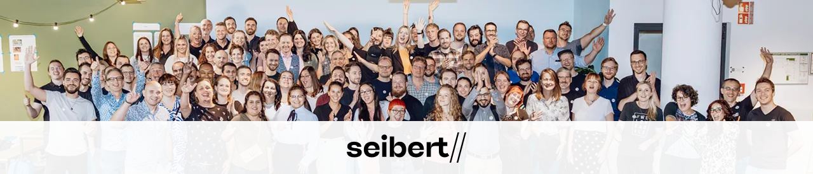
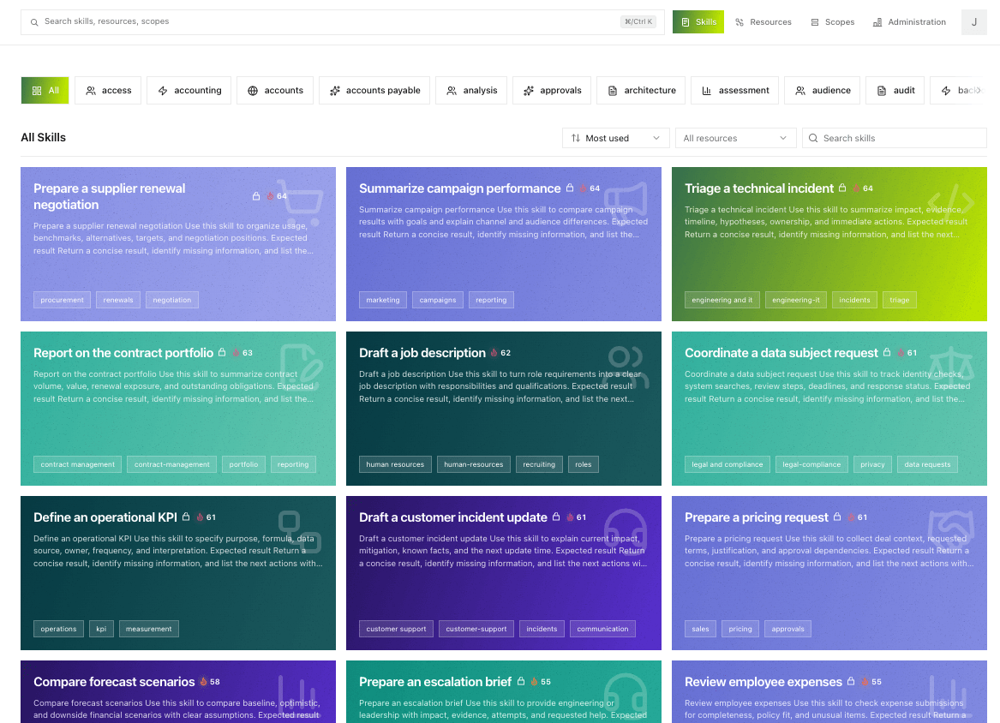
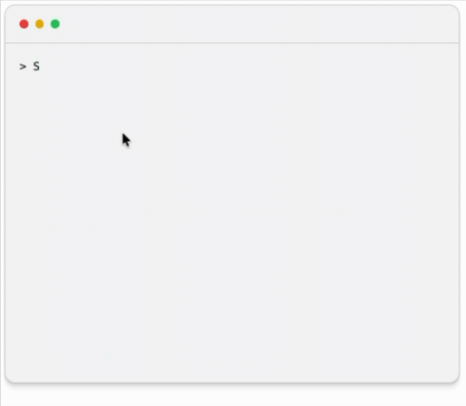
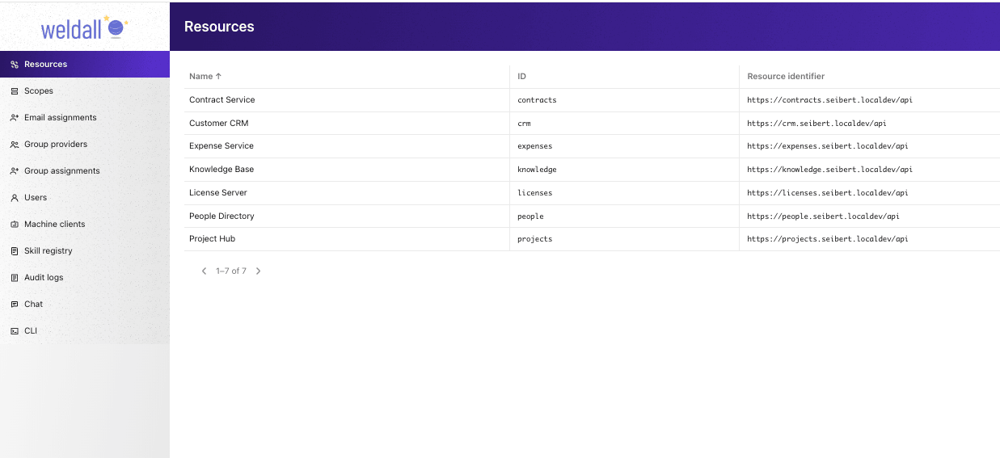
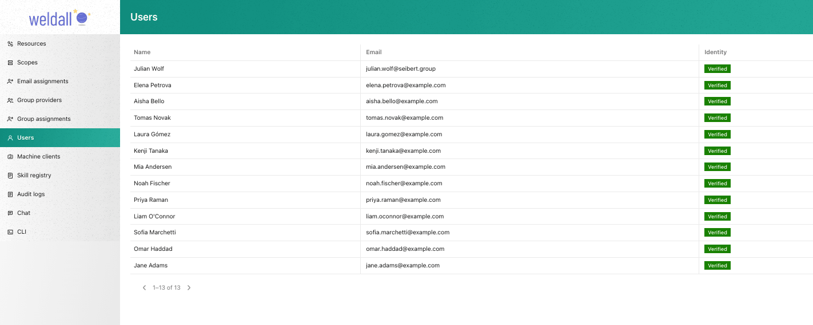
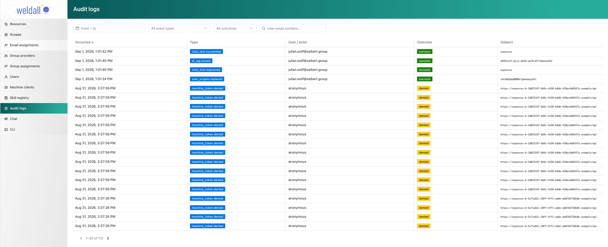

<div align="center">
  <picture>
    <source media="(prefers-color-scheme: dark)" srcset="docs/assets/weldall.png" />
    
  </picture>
</div>

<p align="center">
  <strong>Serve AI-agent skills centrally and connect company resources to the right people, groups, and machines.</strong>
</p>

<p align="center">
  <a href="https://github.com/seibert-external/weldall/blob/main/LICENSE"></a>
  <a href="https://datatracker.ietf.org/doc/html/draft-ietf-oauth-identity-assertion-authz-grant-04"></a>
  <a href="https://datatracker.ietf.org/doc/html/draft-parecki-oauth-jwt-dpop-grant-01"></a>
  <a href="https://www.rfc-editor.org/rfc/rfc9449.html"></a>
  <a href="https://www.rfc-editor.org/rfc/rfc8252.html"></a>
  <a href="https://docs.weldall.ai"></a>
</p>

---



## What is Weldall CLI?

Weldall CLI is a central access layer between **employees with their agents (like Claude, Copilot, pi, Open Code, ...)** on one side and **company APIs and skills** on the other. It defines, in one place:

1. **Which capabilities agents may use** — published as _skills_ in a central catalog.
2. **Who gets them** — per person, per group, or per machine, configured in the UI or in YAML files.
3. **Where they apply** — each _resource_ (a service or API) defines its own supported permissions and request scope.

Capabilities are defined centrally by administrators. Agents discover what they are allowed to do via the Weldall CLI. Each employee's agent gets its own skill set from the catalog, so you steer what your agents can do centrally and roll out the same workflows consistently across the company.

The **agent never sees an access token.** The local CLI keeps credentials in the operating system's secure credential store and sends short-lived, device-bound (DPoP) requests itself. Captured tokens cannot be replayed on another machine, and every granted or denied request is recorded for audit.

<p align="center">
  
</p>

## Who is this for?

- **You run a company (or an IT department)** and a couple of vibe coders are building important apps for it. Instead of letting them sprinkle API tokens all over the place, you get one place to see what those apps can touch and to revoke it again.
- **You serve AI-agent skills centrally** — a federated skill directory, so what your systems can do lives in one catalog. Everyone gets their own directory, based on their permissions.
- **You connect different services to different groups** — some scopes for one team, other scopes for another, all without editing code.
- **You run your own identity provider** — users sign in through the SSO they already use; machines authenticate as their own registered identities, and groups can come from LDAP or Active Directory.
- **You build internal APIs** and don't want to roll your own auth for every one — there are drop-in resource-server SDKs for TypeScript (Fetch, Hono, Next.js, Astro) and Python (FastAPI, Django).

<div align="center">
  
</div>

## A reference implementation of modern OAuth

Weldall CLI is a reference implementation of the next generation of OAuth for agentic applications: it uses DPoP-bound API requests and ID-JAGs to reduce the risk of credential leaks.

| Standard                                                                                                                                                   | What it provides                                                                                                                                                                         |
| ---------------------------------------------------------------------------------------------------------------------------------------------------------- | ---------------------------------------------------------------------------------------------------------------------------------------------------------------------------------------- |
| [ID-JAG — Identity Assertion JWT Authorization Grant (Draft-04)](https://datatracker.ietf.org/doc/html/draft-ietf-oauth-identity-assertion-authz-grant-04) | The authorization server issues a short-lived identity assertion for a specific resource, client, scope set, and device — the core grant that lets an agent act without holding a token. |
| [JWT Authorization Grant with DPoP (Draft-01)](https://datatracker.ietf.org/doc/html/draft-parecki-oauth-jwt-dpop-grant-01)                                | The resource server exchanges the identity assertion for an access token bound to the device key.                                                                                        |
| [RFC 9449 — DPoP (Demonstrating Proof of Possession)](https://www.rfc-editor.org/rfc/rfc9449.html)                                                         | Sender-constrained tokens: a stolen token is useless on another machine.                                                                                                                 |
| [RFC 8252 — OAuth 2.0 for Native Apps](https://www.rfc-editor.org/rfc/rfc8252.html)                                                                        | Browser-based sign-in for the CLI, with explicit consent.                                                                                                                                |
| [RFC 7636 — PKCE](https://www.rfc-editor.org/rfc/rfc7636.html)                                                                                             | Protects the native authorization code exchange.                                                                                                                                         |
| [RFC 9700 — OAuth Security Best Current Practice](https://www.rfc-editor.org/rfc/rfc9700.html)                                                             | Applied throughout the authorization server and client.                                                                                                                                  |

## Quick start

### Install the local CLI

```sh
npm install --global @weldall/cli@latest
weldall --version
weldall config set-issuer https://weldall.example.com
weldall login
```

Standalone binaries (no Node.js required) are available for Linux x64, Windows x64, and macOS from the [releases page](https://github.com/seibert-external/weldall/releases).

### A typical inspection flow

```sh
weldall status          # who am I, what can I do?
weldall whoami --json
weldall scopes          # which scopes are granted?
weldall skills find expense
weldall skills list     # browse all visible capabilities
weldall skills expenses.review
```

### Make an authenticated request

```sh
weldall request --scope expenses:read \
  https://expenses.example.com/api/expenses
```

Every request requires an absolute HTTPS URL and at least one `--scope`; the CLI checks the target against the registered resources before sending anything.

## What's in the box

| Workspace                             | Purpose                                                                                         |
| ------------------------------------- | ----------------------------------------------------------------------------------------------- |
| [`@weldall/weldall`](apps/weldall/)   | The Next.js authorization server, administration UI, and authenticated chat experience.         |
| [`@weldall/cli`](apps/cli/)           | Cross-platform CLI: IaC, interactive OAuth login, capability discovery, authenticated requests. |
| [`@weldall/sdk`](packages/sdk/)       | TypeScript resource-server SDK for Fetch, Hono, Next.js, and Astro.                             |
| [`weldall-sdk`](packages/python-sdk/) | Python resource-server SDK for framework-neutral use, FastAPI, and Django.                      |
| [`@weldall/dev-idp`](apps/dev-idp/)   | A local-only OpenID Connect provider for development.                                           |
| [`@weldall/expenses`](apps/expenses/) | A demo resource server protected by the SDK.                                                    |
| [`@weldall/docs`](apps/docs/)         | The documentation site (German and English).                                                    |
| [`@weldall/db`](packages/db/)         | The Prisma database package and migrations.                                                     |

## Compatibility

Weldall works with any agent that can invoke the CLI. We recommend the open-source agents we use every day:

|  [OpenWork](https://openworklabs.com) |  [Pi](https://pi.dev) |
| ---------------------------------------------------------------------------------------------------------------------------------------- | ------------------------------------------------------------------------------------------------------------------ |
| Desktop app                                                                                                                              | Terminal agent                                                                                                     |

[Claude Code](https://docs.anthropic.com/en/docs/claude-code), [OpenCode](https://opencode.ai), [Codex CLI](https://developers.openai.com/codex/), and [Gemini CLI](https://github.com/google-gemini/gemini-cli) can also invoke the CLI.

Runs on  macOS (Apple Silicon + Intel),  Windows (x64), and  Linux (x64).

## Documentation

Full documentation lives at **[docs.weldall.ai](https://docs.weldall.ai)**

- [Compatibility](apps/docs/src/content/docs/compatibility.mdx) — recommended agents and supported operating systems.
- [A complete agent run](apps/docs/src/content/docs/agent-run.mdx) — the protocol walkthrough.
- [Security model and OAuth standards](apps/docs/src/content/docs/oauth-security.mdx) — DPoP, ID-JAG, and the protocol's security guarantees.
- [How to integrate a service](apps/docs/src/content/docs/service-configuration.md) — protect your API with the SDK.
- [Machine authentication](apps/docs/src/content/docs/machine-authentication.mdx) — machines as first-class identities.
- [Group providers](apps/docs/src/content/docs/group-provider-http-interface.md) — read groups and memberships from LDAP or Active Directory environments.
- [`@weldall/sdk` reference](packages/sdk/README.md) — TypeScript route protection, skill catalogs, framework adapters.
- [`weldall-sdk` reference](packages/python-sdk/README.md) — Python core, FastAPI/Django adapters, and machine client.
- [Local development](apps/docs/) — set up the full stack on your machine.

## Screenshots



_Register downstream services and control where each scope may be used._



_Manage who can sign in; identities are verified through the company SSO._



_Every granted or denied request is recorded, so administrators can trace who asked for what._

## License

FSL-1.1-ALv2 (Functional Source License). Source-available and free to use, modify, and distribute for any purpose other than offering it as a competing commercial service. Each released version converts to Apache-2.0 on its second anniversary.
